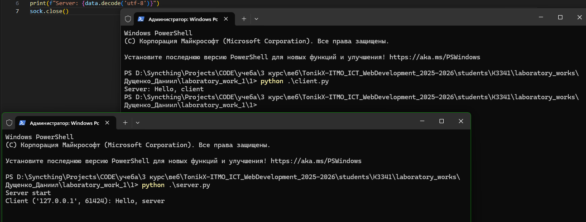
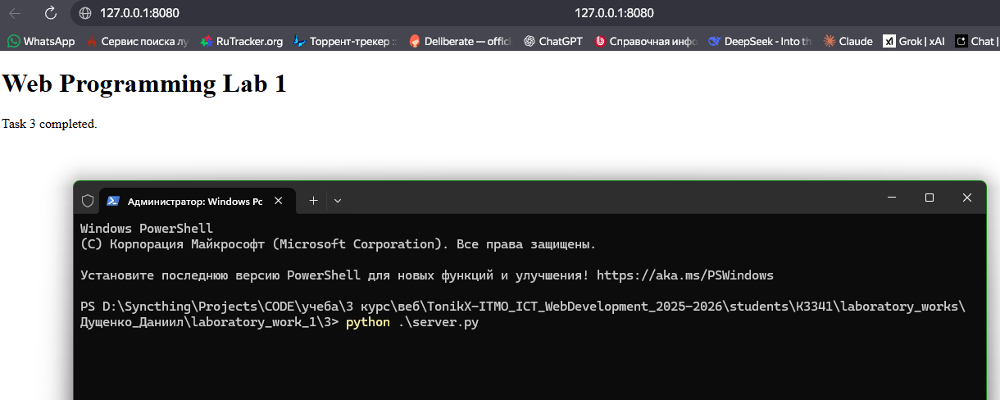
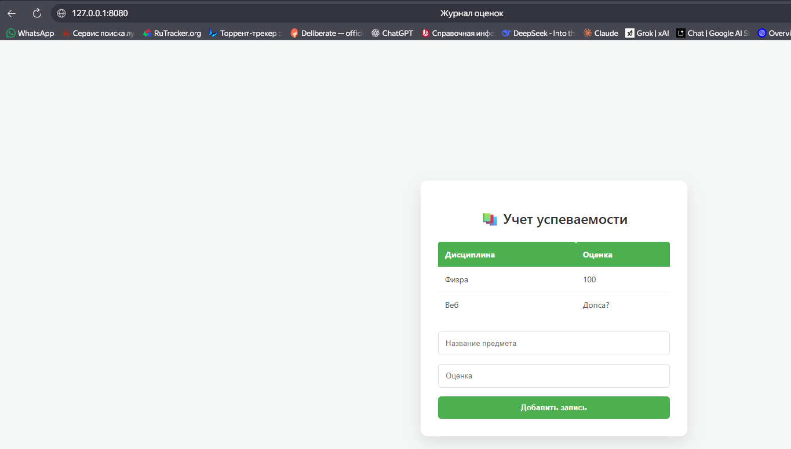

# Отчет по лабораторной работе №1
## Работа с сокетами в Python

**Выполнил:** Студент группы К3341 Дущенко Даниил Александрович

### Цель работы
Реализовать клиент-серверные приложения с использованием библиотеки `socket`, изучить протоколы UDP и TCP, реализовать многопоточную обработку подключений (`threading`) и простейший веб-сервер с поддержкой методов GET и POST.

---

### Задание 1. Реализация клиент-серверного приложения (UDP)
**Постановка задачи:** Реализовать обмен сообщениями "Hello, server" — "Hello, client" по протоколу UDP.

**Реализация:**
Использовался `socket.SOCK_DGRAM`. Сервер принимает данные и адрес, затем отправляет ответ на полученный адрес. Соединение не устанавливается (UDP).

*Код сервера (server.py):*
```python
import socket

sock = socket.socket(socket.AF_INET, socket.SOCK_DGRAM)
sock.bind(('127.0.0.1', 9090))
print("Server start")

while True:
    data, addr = sock.recvfrom(1024)
    print(f"Client {addr}: {data.decode('utf-8')}")
    sock.sendto(b'Hello, client', addr)
```

*Код клиента (client.py):*
```python
import socket

sock = socket.socket(socket.AF_INET, socket.SOCK_DGRAM)
sock.sendto(b'Hello, server', ('127.0.0.1', 9090))
data, _ = sock.recvfrom(1024)
print(f"Server: {data.decode('utf-8')}")
sock.close()
```

**Результат работы:**


---

### Задание 2. Выполнение математических операций (TCP)
**Постановка задачи:** Клиент отправляет операцию и параметры, сервер вычисляет и возвращает результат. Реализация через TCP.

**Реализация:**
Использовался `socket.SOCK_STREAM`. Сервер парсит строку запроса, выполняет вычисления по варианту и возвращает строку ответа.

*Код сервера:*
```python
import socket
import math

sock = socket.socket(socket.AF_INET, socket.SOCK_STREAM)
sock.bind(('127.0.0.1', 8080))
sock.listen(1)

while True:
    conn, addr = sock.accept()
    data = conn.recv(1024).decode('utf-8')
    if not data:
        conn.close()
        continue
    
    parts = data.split()
    op = parts[0]
    nums = [float(x) for x in parts[1:]]
    result = ""

    if op == '1': 
        res = math.sqrt(nums[0]**2 + nums[1]**2)
        result = f"Hypotenuse: {res}"
    elif op == '2':
        a, b, c = nums[0], nums[1], nums[2]
        d = b**2 - 4*a*c
        if d >= 0:
            x1 = (-b + math.sqrt(d)) / (2*a)
            x2 = (-b - math.sqrt(d)) / (2*a)
            result = f"Roots: {x1}, {x2}"
        else:
            result = "No roots"
    elif op == '3':
        res = (nums[0] + nums[1]) / 2 * nums[2]
        result = f"Trapezoid area: {res}"
    elif op == '4':
        res = nums[0] * nums[1]
        result = f"Parallelogram area: {res}"
    
    conn.send(result.encode('utf-8'))
    conn.close()
```

*Код клиента:*
```python
import socket

sock = socket.socket(socket.AF_INET, socket.SOCK_STREAM)
sock.connect(('127.0.0.1', 8080))

print("1-Pythagoras, 2-Quadratic, 3-Trapezoid, 4-Parallelogram")
op = input("Operation: ")
params = input("Params: ")

sock.send(f"{op} {params}".encode('utf-8'))
data = sock.recv(1024)
print(f"Result: {data.decode('utf-8')}")
sock.close()
```

**Результат работы:**


---

### Задание 3. HTTP-сервер (отдача страницы)
**Постановка задачи:** Сервер должен отдавать HTML-страницу при подключении клиента (браузера).

**Реализация:**
Сервер читает файл `index.html` и формирует HTTP-ответ с заголовками и содержимым файла.

*Код сервера:*
```python
import socket

sock = socket.socket(socket.AF_INET, socket.SOCK_STREAM)
sock.bind(('127.0.0.1', 8080))
sock.listen(1)

while True:
    conn, addr = sock.accept()
    request = conn.recv(1024)
    with open('index.html', 'r', encoding='utf-8') as f:
        content = f.read()
    
    response = "HTTP/1.1 200 OK\r\nContent-Type: text/html\r\n\r\n" + content
    conn.sendall(response.encode('utf-8'))
    conn.close()
```

**Результат работы:**


---

### Задание 4. Многопользовательский чат
**Постановка задачи:** Реализовать чат с поддержкой множества пользователей (использование потоков).

**Реализация:**
Использована библиотека `threading`. На сервере для каждого клиента создается отдельный поток `handle`, который слушает сообщения и рассылает их всем остальным (`broadcast`). На клиенте создан отдельный поток для приема сообщений, чтобы ввод данных (`input`) не блокировал чтение чата.

*Код сервера:*
```python
import socket
import threading

clients = []

def broadcast(message, _socket):
    for client in clients:
        if client != _socket:
            try:
                client.send(message)
            except:
                clients.remove(client)

def handle(conn):
    while True:
        try:
            message = conn.recv(1024)
            broadcast(message, conn)
        except:
            clients.remove(conn)
            conn.close()
            break

server = socket.socket(socket.AF_INET, socket.SOCK_STREAM)
server.bind(('127.0.0.1', 5555))
server.listen()

while True:
    conn, addr = server.accept()
    clients.append(conn)
    threading.Thread(target=handle, args=(conn,)).start()
```

*Код клиента:*
```python
import socket
import threading

def receive(sock):
    while True:
        try:
            data = sock.recv(1024)
            print(data.decode('utf-8'))
        except:
            break

sock = socket.socket(socket.AF_INET, socket.SOCK_STREAM)
sock.connect(('127.0.0.1', 5555))

threading.Thread(target=receive, args=(sock,)).start()

name = input("Name: ")
while True:
    msg = input()
    sock.send(f"{name}: {msg}".encode('utf-8'))
```

**Результат работы:**


---

### Задание 5. Веб-сервер с обработкой GET и POST
**Постановка задачи:** Сервер должен принимать данные об оценках через форму (POST) и отображать их в таблице (GET).

**Реализация:**
Сервер анализирует HTTP-запрос. Если метод POST, тело запроса парсится, параметры декодируются (`unquote_plus`) и добавляются в список. HTML-страница генерируется динамически с использованием CSS для стилизации.

*Код сервера:*
```python
import socket
from urllib.parse import unquote_plus

grades = []

sock = socket.socket(socket.AF_INET, socket.SOCK_STREAM)
sock.bind(('127.0.0.1', 8080))
sock.listen(5)

while True:
    try:
        conn, addr = sock.accept()
        req = conn.recv(8192).decode('utf-8')
        if not req: 
            conn.close()
            continue
        
        if 'POST' in req.split('\n')[0]:
            body = req.split('\r\n\r\n')[1]
            params = {}
            for p in body.split('&'):
                if '=' in p:
                    key, val = p.split('=')
                    params[key] = unquote_plus(val)
            
            if 'subj' in params and 'grade' in params:
                grades.append(params)

        if not grades:
            html_rows = "<tr><td colspan='2' style='text-align:center'>Пока нет записей</td></tr>"
        else:
            html_rows = "".join([f"<tr><td>{g['subj']}</td><td>{g['grade']}</td></tr>" for g in grades])
        
        page = f"""
        <!DOCTYPE html>
        <html lang="ru">
        <head><meta charset="utf-8"><title>Журнал</title>
        <style>
            body {{ font-family: sans-serif; background: #f4f7f6; display: flex; justify-content: center; }}
            .card {{ background: white; padding: 30px; border-radius: 12px; width: 400px; }}
            table {{ width: 100%; border-collapse: collapse; margin-bottom: 20px; }}
            th, td {{ padding: 10px; border-bottom: 1px solid #eee; }}
            input {{ width: 100%; padding: 8px; margin: 5px 0; }}
        </style>
        </head>
        <body>
            <div class="card">
                <h2>Учет успеваемости</h2>
                <table><tr><th>Дисциплина</th><th>Оценка</th></tr>{html_rows}</table>
                <form method="POST">
                    <input type="text" name="subj" placeholder="Предмет" required>
                    <input type="text" name="grade" placeholder="Оценка" required>
                    <input type="submit" value="Добавить">
                </form>
            </div>
        </body></html>
        """
        
        resp = "HTTP/1.1 200 OK\r\nContent-Type: text/html; charset=utf-8\r\n\r\n" + page
        conn.sendall(resp.encode('utf-8'))
        conn.close()
    except:
        conn.close()
```

**Результат работы:**


---

### Вывод
В ходе лабораторной работы были изучены основы сетевого взаимодействия на языке Python с использованием библиотеки `socket`. Реализованы приложения на протоколах TCP и UDP. Для реализации многопользовательского чата была применена многопоточность (`threading`). Также был написан HTTP-сервер, корректно обрабатывающий данные форм (POST-запросы) и декодирующий кириллицу.
