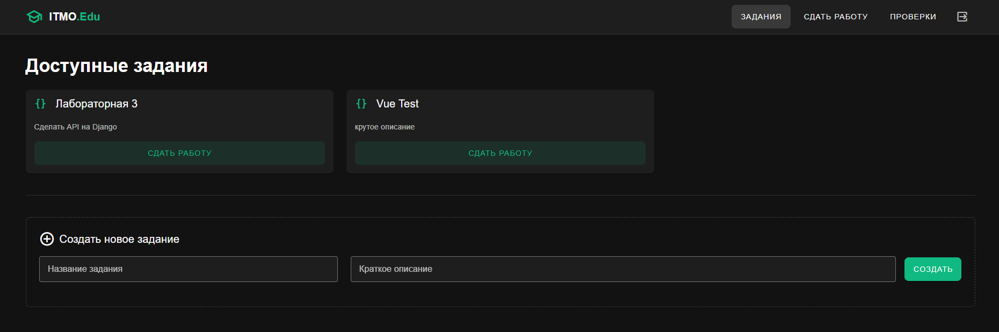
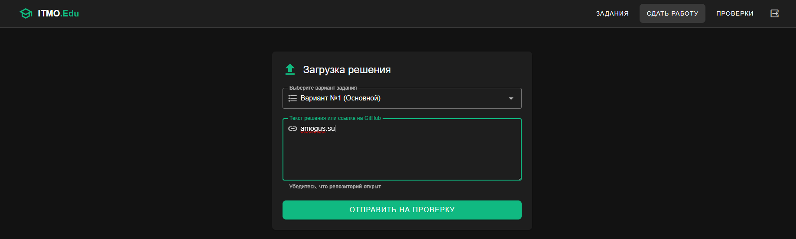
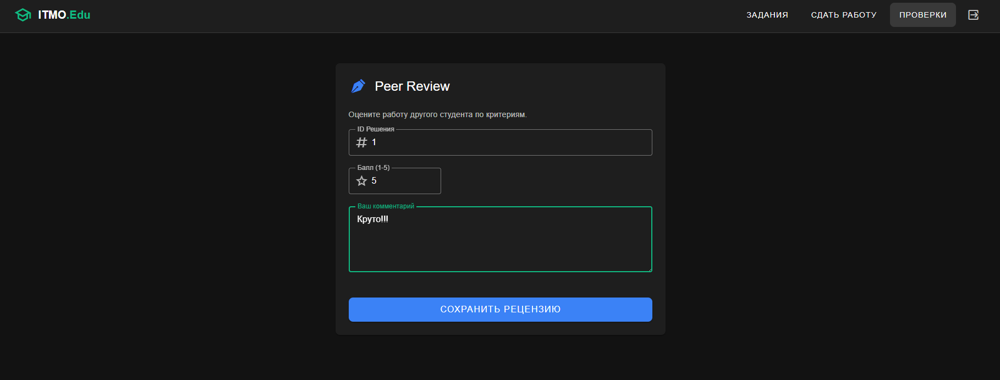

# Отчет по лабораторной работе №4
## Реализация клиентской части на Vue.js

**Выполнил:** Студент группы К3341 Дущенко Даниил Александрович

### Цель работы
Разработать одностраничное приложение (SPA) на фреймворке Vue.js 3, настроить взаимодействие с Django REST API через библиотеку Axios, реализовать интерфейс с использованием компонентов Vuetify.

---

### Ход работы

#### 1. Настройка проекта
Был создан проект с использованием сборщика **Vite**. Установлены библиотеки:
*   `vue-router` — для навигации между страницами.
*   `axios` — для отправки HTTP-запросов к серверу Django.
*   `vuetify` — библиотека компонентов (Material Design).

На стороне сервера (Django) был настроен **CORS**, чтобы разрешить запросы с порта 5173.

#### 2. Реализация интерфейсов

**Авторизация**
Реализована форма входа. При успешном логине полученный от сервера токен сохраняется в `localStorage` браузера и используется для всех последующих запросов.


**Просмотр и создание заданий**
Страница отображает список заданий, полученных GET-запросом. Реализована форма создания нового задания (POST-запрос).


**Сдача работы**
Интерфейс для отправки решения студентом.


**Оценивание (Peer Review)**
Форма для отправки рецензии на чужую работу.


---

### Вывод
В ходе работы было реализовано клиентское приложение на Vue.js. Настроена маршрутизация, взаимодействие с API, хранение токенов авторизации и использование готовых UI-компонентов Vuetify.


---

# Техническая документация: Клиентское приложение (Vue.js)

## 1. Обзор проекта
Приложение представляет собой **Single Page Application (SPA)**, разработанное для взаимодействия с REST API образовательной платформы. Оно предоставляет интерфейсы для преподавателей и студентов, включая систему взаимного оценивания (Peer Review).

### Стек технологий
*   **Фреймворк:** Vue.js 3 (Composition API)
*   **Сборщик:** Vite
*   **UI Библиотека:** Vuetify 3 (Material Design)
*   **Маршрутизация:** Vue Router 4
*   **HTTP Клиент:** Axios

---

## 2. Установка и Запуск

Для работы клиента необходимо, чтобы **Backend (Django)** был запущен и принимал запросы.

### Предварительные требования
*   Node.js (версия 16+)
*   Python 3.10+ (для сервера)

### Команды для запуска

**1. Запуск Сервера (Backend):**
В папке `laboratory_work_3/education_platform`:
```bash
# Активация окружения (если есть)
python manage.py migrate
python manage.py runserver
```
*Сервер должен быть доступен по адресу: `http://127.0.0.1:8000`*

**2. Запуск Клиента (Frontend):**
В папке `laboratory_work_4/education_client`:
```bash
# Установка зависимостей (первый раз)
npm install

# Запуск в режиме разработки
npm run dev
```
*Клиент будет доступен по адресу: `http://localhost:5173`*

---

## 3. Архитектура приложения

### Структура проекта
*   `src/main.js` — Точка входа. Настройка глобальной темы (Vuetify) и маршрутизации.
*   `src/App.vue` — Корневой компонент. Содержит навигационную панель (AppBar) и контейнер для контента.
*   `src/components/` — Папка с компонентами страниц.

### Описание компонентов

| Компонент | Роутинг | Описание | Доступ |
| :--- | :--- | :--- | :--- |
| `Login.vue` | `/` | Авторизация пользователя по токену. | Все |
| `Register.vue` | `/register` | Регистрация новых пользователей. | Все |
| `Assignments.vue` | `/assignments` | Список заданий. Форма создания задания (для преподавателя). | Auth |
| `Submission.vue` | `/submit` | Форма сдачи работы. Выбор варианта из списка, загрузка ссылки. История своих решений. | Auth |
| `Reviews.vue` | `/reviews` | Таблица чужих решений. Форма для выставления оценки и комментария. | Auth |
| `TeacherDashboard.vue` | `/dashboard` | Сводная таблица всех студентов, работ и средних баллов. | Auth |
| `Profile.vue` | `/profile` | Смена пароля пользователя. | Auth |

---

## 4. Реализованные возможности

### 🔐 Аутентификация и Безопасность
*   **Token-based Auth:** При входе приложение получает токен от Djoser и сохраняет его в `localStorage`.
*   **Axios Interceptors:** Токен автоматически добавляется в заголовок `Authorization` каждого запроса.
*   **Защита маршрутов:** Интерфейс адаптируется под состояние входа (скрытие меню на странице логина).

### 📚 Управление заданиями
*   Отображение списка заданий в виде карточек.
*   Преподаватель может создавать новые задания через модальное окно/форму на странице списка.

### 📤 Система сдачи работ
*   Динамическая загрузка вариантов задания с сервера.
*   Студент выбирает вариант из выпадающего списка.
*   Отображение таблицы "Мои сданные работы" с датой и статусом.

### ⚖️ Взаимная проверка (Peer Review)
*   Студенты видят таблицу всех решений (кроме своих в режиме оценки).
*   При выборе решения открывается форма рецензирования.
*   Оценка (1-5) и комментарий сохраняются в БД и привязываются к работе.

### 📊 Журнал преподавателя
*   Агрегация данных: таблица показывает Студента, Вариант, Ссылку на работу.
*   **Визуализация оценок:** Оценки отображаются в виде "чипсов", при наведении всплывает комментарий рецензента.
*   **Расчеты:** Автоматический подсчет среднего балла за работу.

### ⚙️ Профиль пользователя
*   Возможность смены пароля (требует ввода старого пароля для безопасности).

---

## 5. Взаимодействие с API

Приложение настроено на работу с Django REST Framework.
Пример конфигурации Axios для запроса списка заданий:

```javascript
// GET Request
const res = await axios.get('http://127.0.0.1:8000/api/assignments/', {
  headers: { 
    Authorization: `Token ${localStorage.getItem('auth_token')}` 
  }
});
```

**Обработка ошибок:**
Реализована базовая обработка ошибок (try/catch) с выводом уведомлений пользователю (Alerts) при неудачной авторизации или ошибках сервера (400/403/500).
