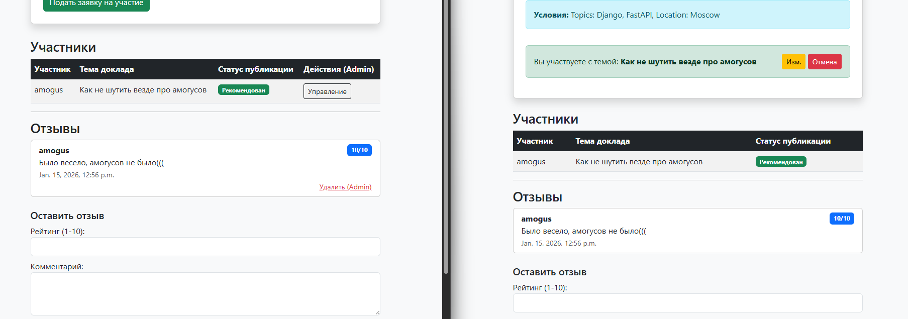

# Отчет по лабораторной работе №2
## Разработка веб-приложения на Django

**Выполнил:** Студент группы К3341 Дущенко Даниил Александрович

### Цель работы
Реализовать веб-приложение для управления научными конференциями с использованием фреймворка Django 3+ и СУБД PostgreSQL. Реализовать функционал регистрации, подачи заявок, модерации, отзывов, а также поиск и пагинацию.

---

### Ход работы

#### 1. Проектирование Базы Данных
В соответствии с заданием были созданы следующие модели данных:
*   **Conference** (Конференция): название, темы, место, даты, описание.
*   **Participation** (Участие): связывает пользователя и конференцию, хранит тему доклада и статус рекомендации.
*   **Review** (Отзыв): хранит текст отзыва и рейтинг (1-10).

Для взаимодействия с БД PostgreSQL использовался драйвер `psycopg2`.

#### 2. Реализация интерфейса (Bootstrap 5)
Для верстки использовался фреймворк Bootstrap 5. Реализовано адаптивное меню, карточки конференций и формы.
*   Главная страница отображает список конференций.
*   Реализован **поиск** по названию и тематикам (фильтрация QuerySet).
*   Реализована **пагинация** (разбиение списка на страницы).

#### 3. Разделение прав доступа
Реализована логика разграничения прав доступа на стороне клиента (в шаблонах):
*   Администраторы видят дополнительные элементы управления (кнопки редактирования/удаления чужих записей).
*   Обычные пользователи видят только общедоступную информацию и свои заявки.

!

#### 4. Управление статусом публикации
Администратор через панель Django Admin может отмечать доклады как "Рекомендованные к публикации". Этот статус отображается в общей таблице участников.

#### 5. Система отзывов
Авторизованные пользователи могут оставлять отзывы к конференциям с выставлением рейтинга.

---

### Вывод
В ходе лабораторной работы было разработано полнофункциональное веб-приложение на Django.
*   Настроено подключение к СУБД **PostgreSQL**.
*   Реализован **CRUD** функционал для заявок и отзывов.
*   Выполнены требования по реализации **поиска и пагинации**.
*   Реализовано **разделение прав** пользователей и администраторов.
*   Интерфейс стилизован с помощью **Bootstrap**.